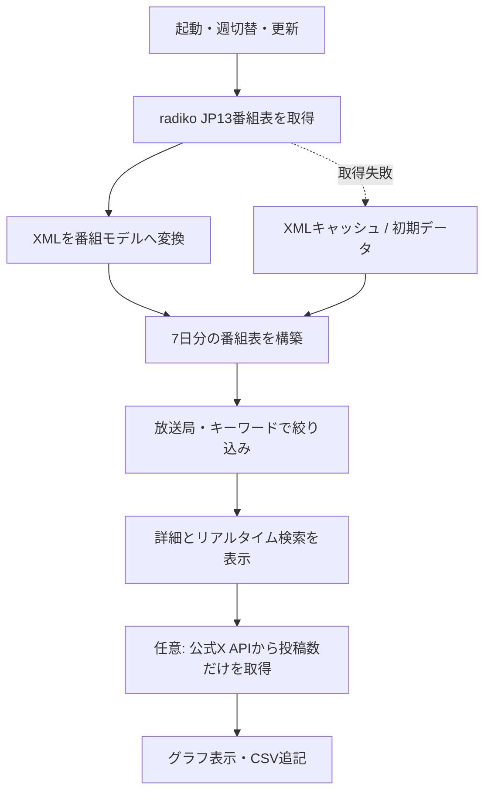

<h1 align="center">RadioPulseViewer</h1>

<p align="center">
  週間ラジオ番組表・リアルタイム検索・公式X投稿数分析を1つにまとめたWindowsデスクトップアプリ<br>
  C# / WPF / .NET 10 / WebView2 / Windows x64
</p>

RadioPulseViewerは、東京エリアのラジオ番組表を7日分取得し、放送局や番組名で絞り込みながら閲覧できるWPFアプリです。番組を選ぶと詳細情報とYahoo! JAPANリアルタイム検索を並べて表示し、任意で公式X APIから投稿数だけを取得して推移を確認できます。

本リポジトリは、ビルドに必要なソース、プロジェクト、初期データだけを収録した提出用構成です。ビルド済みEXE / DLL、NuGet復元物、Visual Studioの個人設定、WebView2の閲覧履歴・Cookie・キャッシュ、APIトークンは含めていません。

## 主な機能

| 領域 | 実装内容 |
| --- | --- |
| 週間番組表 | 月曜から日曜までの7列で番組を表示し、前週・今週・次週を切り替え |
| 番組取得 | radikoの東京エリア（`JP13`）番組表を日単位で取得し、最大3件を並行処理 |
| 絞り込み | 放送局フィルター、番組名・出演者・ハッシュタグを対象にしたキーワード検索 |
| 番組詳細 | 放送日時、出演者、ハッシュタグ、説明、放送中表示を選択番組ごとに表示 |
| リアルタイム検索 | 番組のハッシュタグ・検索語・タイトルを使い、Yahoo! JAPANリアルタイム検索をWebView2内に表示 |
| 公式X投稿数 | X API v2のrecent countsから6時間・24時間・7日間の投稿数を取得し、区間別グラフと合計を表示 |
| CSV蓄積 | 取得日時、検索語、対象期間、区間、投稿数だけをローカルCSVへ追記 |
| 外部リンク | radiko、番組公式サイト、放送局公式番組表、現在の検索ページを既定ブラウザーで開く |
| オフライン補助 | 取得済みXMLのキャッシュと`Data/programs.json`の初期データで取得失敗時を補助 |

RadioPulseViewer自体は音声を再生・録音・配信しません。「radikoで聴く」はradikoのページを外部ブラウザーで開く操作です。

Yahoo! JAPANリアルタイム検索はWebページをそのまま表示し、DOM解析、通信傍受、ツールチップ操作などによるスクレイピングは行いません。投稿数分析はYahooのグラフを読み取るのではなく、利用者自身のBearer Tokenで公式X APIを呼び出します。

## 処理の流れ



起動直後は[`programs.json`](RadioPulseViewer/Data/programs.json)の初期データを読み込み、その後、ネットワークから取得した対象週の番組表で表示を更新します。取得できない場合は保存済みXML、さらに初期データが表示を補います。

## 画面操作

1. 上部の「放送局」と「番組検索」で表示対象を絞り込みます。
2. 「前週」「今週」「次週」で対象週を移動し、「番組表更新」で再取得します。
3. 週間番組表の番組カードを選択すると、右側に詳細とリアルタイム検索が表示されます。
4. 詳細欄からradiko、番組公式サイト、局公式番組表を開けます。
5. 「公式X投稿数」を開くと、現在の検索語を引き継いで投稿数分析画面を表示します。
6. 期間を選択して「投稿数を取得」を押すと、合計・区間別グラフ・CSVを更新します。

放送局を選択して「選択局の公式番組表」を押すと、その局の番組表を外部ブラウザーで開きます。リンクは`http` / `https`のみを対象にしています。

## 公式X投稿数機能

### 取得方式

次の公式エンドポイントだけを使用します。

```text
GET https://api.x.com/2/tweets/counts/recent
```

- 対象は直近7日以内です。
- 6時間・24時間は1時間単位、7日は1日単位で表示します。
- 投稿本文、投稿者、プロフィール、画像、動画は取得しません。
- 同一条件の再取得は10分間メモリキャッシュを利用します。
- 認証・権限・レート制限を回避する処理はありません。

公式X APIの集計値は、Yahoo! JAPANリアルタイム検索のグラフ値ではありません。集計対象、更新時刻、除外処理などが異なるため一致しない可能性があります。分析資料では「X API集計値」と明記してください。

### Bearer Token

Bearer TokenはWindowsのユーザー環境変数へ設定します。

```powershell
setx RADIOPULSE_X_BEARER_TOKEN "YOUR_BEARER_TOKEN"
```

設定後、RadioPulseViewerを完全に終了してから再起動してください。互換用に`X_BEARER_TOKEN`も参照しますが、専用の`RADIOPULSE_X_BEARER_TOKEN`を推奨します。

Tokenはソースコード、JSON、CSV、ログへ保存しません。X Developer Account、Project、App、利用時点で必要な契約・権限は利用者側で用意してください。

詳細は[`docs/X_API_SETUP.md`](docs/X_API_SETUP.md)を参照してください。

### CSV

取得結果は次へ追記されます。

```text
%LOCALAPPDATA%\RadioPulseViewer\XPostCounts\x-post-counts.csv
```

保存するのは取得日時、検索語、対象期間、各集計区間の開始・終了、投稿数だけです。

## 動作環境

- Windows x64
- [.NET 10 SDK](https://dotnet.microsoft.com/download/dotnet/10.0)（ビルド時）
- .NET 10 Desktop Runtime（フレームワーク依存アプリとしての実行時）
- [Microsoft Edge WebView2 Evergreen Runtime](https://developer.microsoft.com/microsoft-edge/webview2/)の現行サポート版
- radiko番組表とWeb検索に接続できるネットワーク環境
- 公式X投稿数機能を使う場合はX Developer AppとBearer Token

WebView2はNuGetパッケージ`Microsoft.Web.WebView2` `1.0.4078.44`を使用します。復元されるパッケージとWebView2 Runtimeには、このリポジトリとは別のライセンス・サポート条件が適用されます。

## ビルドと実行

### バッチファイル

Windowsで.NET 10 SDKを用意し、リポジトリ直下の次のファイルを実行します。

```bat
Rebuild_Release_x64.bat
```

成功時のEXEは次の場所です。

```text
RadioPulseViewer\bin\Release\net10.0-windows\RadioPulseViewer.exe
```

### CLI

```powershell
dotnet restore .\RadioPulseViewer\RadioPulseViewer.csproj
dotnet build .\RadioPulseViewer\RadioPulseViewer.csproj -c Release -p:Platform=x64 --no-restore
```

Visual Studioでは[`RadioPulseViewer.sln`](RadioPulseViewer.sln)を開き、構成`Release`、プラットフォーム`x64`を選択してビルドできます。プロジェクトは`SelfContained=false`なので、配布先には対応する.NET Desktop Runtimeが必要です。

## データとキャッシュ

### 番組表取得

| 項目 | 実装値 |
| --- | --- |
| 対象エリア | 東京`JP13` |
| 取得単位 | 対象週の7日、日単位XML |
| 接続先 | `https://radiko.jp/v3/program/date/{yyyyMMdd}/JP13.xml` |
| HTTPタイムアウト | 25秒 |
| 最大並行数 | 3日分 |
| 当日・未来日のキャッシュ | 20分 |
| 過去日のキャッシュ | 12時間 |
| キャッシュ場所 | `%LOCALAPPDATA%\RadioPulseViewer\ScheduleCache` |

ネットワーク取得に失敗し、古いキャッシュが存在する場合は、有効期限を過ぎていても最後に保存されたXMLを表示の補助に使います。番組表の正確性や更新時刻は画面の状態表示と提供元の公式情報で確認してください。

### 初期データ

[`RadioPulseViewer/Data/programs.json`](RadioPulseViewer/Data/programs.json)は、取得開始前または取得失敗時に表示する参照データです。

| 項目 | 収録状況 |
| --- | --- |
| 最終確認日 | `2026-07-16` |
| 放送局 | 15局 |
| 初期番組 | 195件、うち10局分 |

残る5局（`RN1`、`RN2`、`IBS`、`JOAK`、`JOAK-FM`）は局情報のみで、初期番組を収録していません。通常はネットワーク取得した番組表が使われます。初期データは参考用であり、現在の編成、配信地域、聴取可否を保証するものではありません。

JSONの主要構造は次のとおりです。

```json
{
  "lastReviewed": "YYYY-MM-DD",
  "dataNotice": "データに関する注記",
  "stations": [
    {
      "id": "放送局ID",
      "name": "放送局名",
      "shortName": "短縮名",
      "radikoUrl": "https://...",
      "officialScheduleUrl": "https://..."
    }
  ],
  "programs": [
    {
      "stationId": "放送局ID",
      "day": "Monday",
      "start": "06:00",
      "end": "09:00",
      "title": "番組名",
      "performers": "出演者",
      "hashtag": "#番組タグ",
      "searchKeyword": "検索語",
      "programUrl": "https://...",
      "radikoUrl": "https://...",
      "description": "番組説明"
    }
  ]
}
```

`stationId`は`stations[].id`と一致させてください。時刻は`HH:mm`形式を想定し、深夜番組のため`24:00`以降の時刻も扱います。ローダーはURLや時刻の厳密なスキーマ検証を行わないため、このファイルは信頼できる編集者だけが変更し、リンク先と形式をレビューしてください。

## 実装構成

| ファイル | 役割 |
| --- | --- |
| `MainWindow.xaml` / `.xaml.cs` | 週間番組表、絞り込み、選択詳細、WebView2、外部リンク操作 |
| `MainWindow.XPostCounts.cs` | 公式X投稿数分析画面をメイン画面から起動 |
| `XPostCountWindow.xaml` / `.xaml.cs` | 検索条件、合計、区間別グラフ、CSV保存のUI |
| `Services/RadikoScheduleService.cs` | 7日分の取得、キャッシュ、radiko XMLの解析 |
| `Services/ProgramCatalogService.cs` | 初期JSONの読み込みと最小限の整合性確認 |
| `Services/XPostCountService.cs` | 公式X APIのrecent counts呼び出し、認証、キャッシュ、エラー処理 |
| `Services/XPostCountHistoryService.cs` | 投稿数だけをUTF-8 CSVへ追記 |
| `Models/XPostCountModels.cs` | X API応答とアプリ内投稿数モデル |
| `Data/programs.json` | 放送局一覧とフォールバック用初期番組 |

```text
.
├─ RadioPulseViewer.sln
├─ RadioPulseViewer.slnLaunch
├─ Rebuild_Release_x64.bat
├─ LICENSE
├─ NOTICE.md
├─ docs/
│  └─ X_API_SETUP.md
└─ RadioPulseViewer/
   ├─ App.xaml / App.xaml.cs
   ├─ MainWindow.xaml / MainWindow.xaml.cs
   ├─ MainWindow.XPostCounts.cs
   ├─ XPostCountWindow.xaml / XPostCountWindow.xaml.cs
   ├─ RadioPulseViewer.csproj
   ├─ Data/programs.json
   ├─ Models/
   ├─ Services/
   └─ Properties/launchSettings.json
```

## セキュリティとプライバシー

> [!IMPORTANT]
> WebView2は実行時に`RadioPulseViewer.exe.WebView2`というユーザーデータフォルダーをEXEの近くへ作成することがあります。ここには閲覧履歴、Cookie、Local Storage、キャッシュなどが保存され得ます。アプリを配布・共有・アーカイブするときは、このフォルダーを含めないでください。

- 本リポジトリにAPIキー、Bearer Token、パスワード、Cookie、閲覧履歴は含まれません。
- X APIのBearer Tokenは環境変数から実行時にだけ読み込み、画面・CSV・ログへ出力しません。
- X投稿数機能はWebページをスクレイピングせず、投稿本文や利用者情報を取得しません。
- WebView2に表示されるページは外部コンテンツです。WebView2 Runtimeを最新のサポート版に保ち、表示内容を信頼済みデータとして扱わないでください。
- スケジュールXMLキャッシュと投稿数CSVは`%LOCALAPPDATA%`に保存されます。
- 番組や放送局のURLは外部ブラウザーを起動します。`programs.json`を変更する場合はリンク先を確認してください。

## 制約と運用上の注意

- radiko、Yahoo! JAPAN、X、各放送局との提携、承認、保証はありません。
- 外部サービスの仕様、URL、利用条件、料金、権限、地域判定、配信内容が変わると、取得・表示できなくなる可能性があります。
- X APIの401・403・429などを回避する処理はありません。Developer Portalと公式仕様を確認してください。
- 公式X投稿数はYahoo! JAPANリアルタイム検索のグラフ値を再現するものではありません。
- 対象エリアはコード上で`JP13`に固定されています。地域を画面から変更する機能はありません。
- 番組情報には提供元由来のHTMLを除去して表示しますが、内容の正確性・完全性・最新性は保証しません。
- 本リポジトリに自動テストはありません。対象Windows環境でのビルド、画面、通信、外部サービス結合テストは利用者側で実施してください。

外部データ・サービス・依存ライブラリの権利と利用条件は[`NOTICE.md`](NOTICE.md)を参照し、利用時点の最新条件を確認してください。

## ライセンス

RadioPulseViewerのオリジナルソースコードと本リポジトリに追加した文書は[MIT License](LICENSE)です。

`RadioPulseViewer/Data/programs.json`の番組・放送局データ、外部サービスのコンテンツ、Microsoft WebView2などの依存コンポーネントにはMIT Licenseは適用されません。詳細は[`NOTICE.md`](NOTICE.md)を参照してください。
