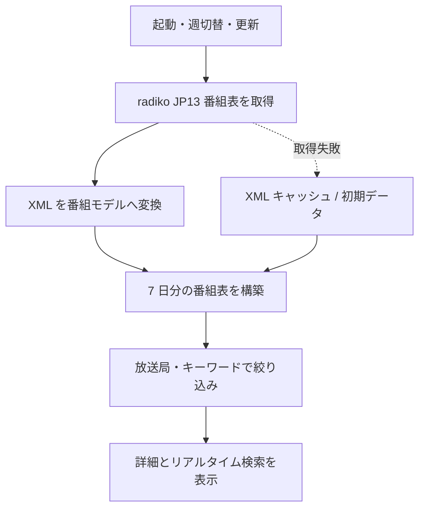

<h1 align="center">RadioPulseViewer</h1>

<p align="center">
  週間ラジオ番組表と番組への反響を、1 つの画面で確認する Windows デスクトップアプリ<br>
  C# / WPF / .NET 10 / WebView2 / Windows x64
</p>

RadioPulseViewer は、東京エリアのラジオ番組表を 7 日分取得し、放送局や番組名で絞り込みながら閲覧できる WPF アプリです。番組を選ぶと詳細情報と Yahoo! JAPAN リアルタイム検索を並べて表示し、radiko、番組公式サイト、放送局の番組表へ移動できます。

本リポジトリは、ビルドに必要なソース、プロジェクト、初期データだけを収録した提出用構成です。ビルド済み EXE / DLL、NuGet 復元物、Visual Studio の個人設定、WebView2 の閲覧履歴・Cookie・キャッシュは含めていません。

## 主な機能

| 領域 | 実装内容 |
| --- | --- |
| 週間番組表 | 月曜から日曜までの 7 列で番組を表示し、前週・今週・次週を切り替え |
| 番組取得 | radiko の東京エリア（`JP13`）番組表を日単位で取得し、最大 3 件を並行処理 |
| 絞り込み | 放送局フィルター、番組名・出演者・ハッシュタグを対象にしたキーワード検索 |
| 番組詳細 | 放送日時、出演者、ハッシュタグ、説明、放送中表示を選択番組ごとに表示 |
| 反響確認 | 番組のハッシュタグ・検索語・タイトルを使い、Yahoo! JAPAN リアルタイム検索を WebView2 内に表示 |
| 外部リンク | radiko、番組公式サイト、放送局公式番組表、現在の検索ページを既定ブラウザーで開く |
| オフライン補助 | 取得済み XML のキャッシュと `Data/programs.json` の初期データで取得失敗時を補助 |

RadioPulseViewer 自体は音声を再生・録音・配信しません。「radikoで聴く」は radiko のページを外部ブラウザーで開く操作です。また、検索結果の抽出・集計・感情分析は行わず、Web ページをそのまま表示します。

## 処理の流れ



起動直後は [`programs.json`](RadioPulseViewer/Data/programs.json) の初期データを読み込み、その後、ネットワークから取得した対象週の番組表で表示を更新します。取得できない場合は保存済み XML、さらに初期データが表示を補います。

## 画面操作

1. 上部の「放送局」と「番組検索」で表示対象を絞り込みます。
2. 「前週」「今週」「次週」で対象週を移動し、「番組表更新」で再取得します。
3. 週間番組表の番組カードを選択すると、右側に詳細とリアルタイム検索が表示されます。
4. 詳細欄から radiko、番組公式サイト、局公式番組表を開けます。
5. WebView2 の「←」「→」「更新」「外部ブラウザ」で検索ページを操作します。

放送局を選択して「選択局の公式番組表」を押すと、その局の番組表を外部ブラウザーで開きます。リンクは `http` / `https` のみを対象にしています。

## 動作環境

- Windows x64
- [.NET 10 SDK](https://dotnet.microsoft.com/download/dotnet/10.0)（ビルド時）
- .NET 10 Desktop Runtime（フレームワーク依存アプリとしての実行時）
- [Microsoft Edge WebView2 Evergreen Runtime](https://developer.microsoft.com/microsoft-edge/webview2/) の現行サポート版
- radiko 番組表と Web 検索に接続できるネットワーク環境

WebView2 は NuGet パッケージ `Microsoft.Web.WebView2` `1.0.4078.44` を使用します。復元されるパッケージと WebView2 Runtime には、このリポジトリとは別のライセンス・サポート条件が適用されます。

## ビルドと実行

### バッチファイルを使う

Windows で .NET 10 SDK を用意し、リポジトリ直下の次のファイルを実行します。

```bat
Rebuild_Release_x64.bat
```

このバッチは NuGet 復元、`Release | x64` のクリーン、ビルドを順に実行します。成功時の EXE は次の場所です。

```text
RadioPulseViewer\bin\Release\net10.0-windows\RadioPulseViewer.exe
```

### CLI を使う

```powershell
dotnet restore .\RadioPulseViewer\RadioPulseViewer.csproj
dotnet build .\RadioPulseViewer\RadioPulseViewer.csproj -c Release -p:Platform=x64 --no-restore
```

Visual Studio では [`RadioPulseViewer.sln`](RadioPulseViewer.sln) を開き、構成 `Release`、プラットフォーム `x64` を選択してビルドできます。プロジェクトは `SelfContained=false` なので、配布先には対応する .NET Desktop Runtime が必要です。

## データとキャッシュ

### 番組表取得

| 項目 | 実装値 |
| --- | --- |
| 対象エリア | 東京 `JP13` |
| 取得単位 | 対象週の 7 日、日単位 XML |
| 接続先 | `https://radiko.jp/v3/program/date/{yyyyMMdd}/JP13.xml` |
| HTTP タイムアウト | 25 秒 |
| 最大並行数 | 3 日分 |
| 当日・未来日のキャッシュ | 20 分 |
| 過去日のキャッシュ | 12 時間 |
| キャッシュ場所 | `%LOCALAPPDATA%\RadioPulseViewer\ScheduleCache` |

ネットワーク取得に失敗し、古いキャッシュが存在する場合は、有効期限を過ぎていても最後に保存された XML を表示の補助に使います。番組表の正確性や更新時刻は画面の状態表示と提供元の公式情報で確認してください。

### 初期データ

[`RadioPulseViewer/Data/programs.json`](RadioPulseViewer/Data/programs.json) は、取得開始前または取得失敗時に表示する参照データです。

| 項目 | 収録状況 |
| --- | --- |
| 最終確認日 | `2026-07-16` |
| 放送局 | 15 局 |
| 初期番組 | 195 件、うち 10 局分 |

残る 5 局（`RN1`、`RN2`、`IBS`、`JOAK`、`JOAK-FM`）は局情報のみで、初期番組を収録していません。通常はネットワーク取得した番組表が使われます。初期データは参考用であり、現在の編成、配信地域、聴取可否を保証するものではありません。

JSON の主要構造は次のとおりです。

```json
{
  "lastReviewed": "YYYY-MM-DD",
  "dataNotice": "データに関する注記",
  "stations": [
    {
      "id": "放送局ID",
      "name": "放送局名",
      "shortName": "短縮名",
      "radikoUrl": "https://...",
      "officialScheduleUrl": "https://..."
    }
  ],
  "programs": [
    {
      "stationId": "放送局ID",
      "day": "Monday",
      "start": "06:00",
      "end": "09:00",
      "title": "番組名",
      "performers": "出演者",
      "hashtag": "#番組タグ",
      "searchKeyword": "検索語",
      "programUrl": "https://...",
      "radikoUrl": "https://...",
      "description": "番組説明"
    }
  ]
}
```

`stationId` は `stations[].id` と一致させてください。時刻は `HH:mm` 形式を想定し、深夜番組のため `24:00` 以降の時刻も扱います。ローダーは URL や時刻の厳密なスキーマ検証を行わないため、このファイルは信頼できる編集者だけが変更し、リンク先と形式をレビューしてください。

## 実装構成

| ファイル | 役割 |
| --- | --- |
| `MainWindow.xaml` / `.xaml.cs` | 週間番組表、絞り込み、選択詳細、WebView2、外部リンク操作 |
| `Services/RadikoScheduleService.cs` | 7 日分の取得、キャッシュ、radiko XML の解析 |
| `Services/ProgramCatalogService.cs` | 初期 JSON の読み込みと最小限の整合性確認 |
| `Models/ProgramInfo.cs` | 番組情報、時刻、検索キーワードの優先順位 |
| `Models/StationInfo.cs` | 放送局情報と表示名 |
| `Models/ScheduleViewModels.cs` | 日別・番組カードの表示モデル |
| `Data/programs.json` | 放送局一覧とフォールバック用初期番組 |

```text
.
├─ RadioPulseViewer.sln
├─ RadioPulseViewer.slnLaunch
├─ Rebuild_Release_x64.bat
├─ LICENSE
├─ NOTICE.md
└─ RadioPulseViewer/
   ├─ App.xaml / App.xaml.cs
   ├─ MainWindow.xaml / MainWindow.xaml.cs
   ├─ RadioPulseViewer.csproj
   ├─ Data/programs.json
   ├─ Models/
   ├─ Services/
   └─ Properties/launchSettings.json
```

## セキュリティとプライバシー

> [!IMPORTANT]
> WebView2 は実行時に `RadioPulseViewer.exe.WebView2` というユーザーデータフォルダーを EXE の近くへ作成することがあります。ここには閲覧履歴、Cookie、Local Storage、キャッシュなどが保存され得ます。アプリを配布・共有・アーカイブするときは、このフォルダーを絶対に含めないでください。

- 本リポジトリに API キー、パスワード、Cookie、閲覧履歴は含まれません。
- WebView2 に表示されるページは外部コンテンツです。WebView2 Runtime を最新のサポート版に保ち、表示内容を信頼済みデータとして扱わないでください。
- スケジュール XML キャッシュは `%LOCALAPPDATA%` に保存されます。不要になったキャッシュはアプリ終了後に削除できます。
- 番組や放送局の URL は外部ブラウザーを起動します。`programs.json` を変更する場合はリンク先を確認してください。
- リアルタイム検索の利用に伴う通信、Cookie、履歴は、Yahoo! JAPAN と WebView2 の設定・ポリシーに従います。

## 制約と運用上の注意

- radiko や Yahoo! JAPAN の非公式クライアントであり、各社・各放送局との提携、承認、保証はありません。
- 外部サービスの仕様、URL、利用条件、地域判定、配信内容が変わると、取得・表示できなくなる可能性があります。
- 対象エリアはコード上で `JP13` に固定されています。地域を画面から変更する機能はありません。
- 番組情報には提供元由来の HTML を除去して表示しますが、内容の正確性・完全性・最新性は保証しません。
- 本リポジトリに自動テストはありません。公開準備時には JSON、XAML、プロジェクト参照の静的整合性を確認していますが、対象 Windows 環境での画面・通信・外部サービス結合テストは利用者側で実施してください。

外部データ・サービス・依存ライブラリの権利と利用条件は [`NOTICE.md`](NOTICE.md) を参照し、利用時点の最新条件を確認してください。

## ライセンス

RadioPulseViewer のオリジナルソースコードと本リポジトリに追加した文書は [MIT License](LICENSE) です。

`RadioPulseViewer/Data/programs.json` の番組・放送局データ、外部サービスのコンテンツ、Microsoft WebView2 などの依存コンポーネントには MIT License は適用されません。詳細は [`NOTICE.md`](NOTICE.md) を参照してください。
